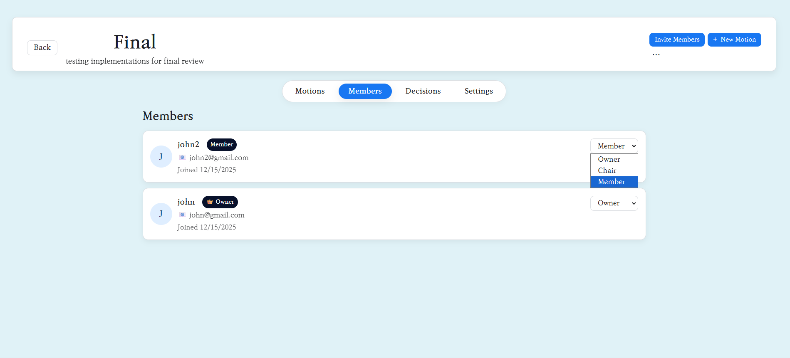
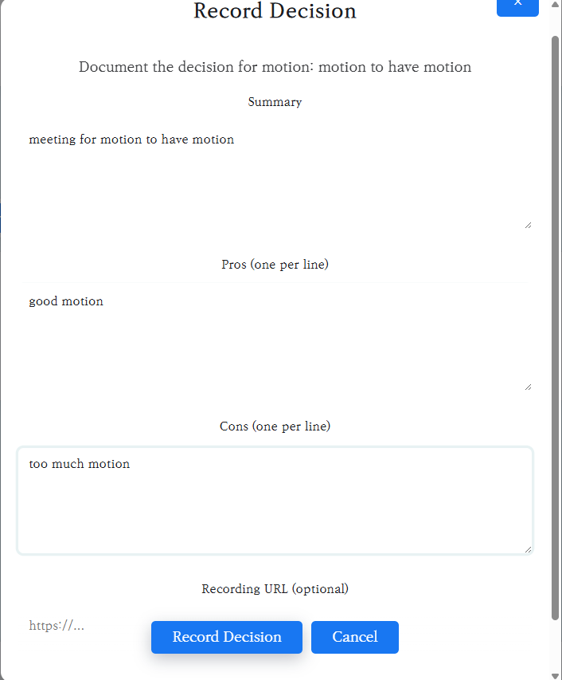
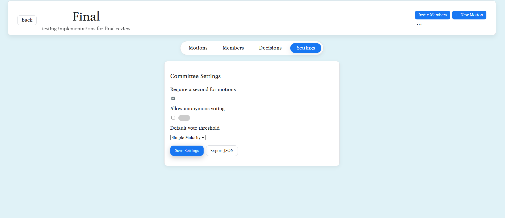

[](https://app.netlify.com/projects/polite-croissant-816eb9/deploys)

# RROO: Robert's Rules of Order Online

This web application is designed to facilitate parliamentary procedures based on Robert's Rules of Order. It allows users to manage motions, committees, and user profiles.

## Video Demo

[Link to YouTube Demo Video](https://www.youtube.com/watch?v=dQw4w9WgXcQ)

## Live Website

The application is hosted on Netlify and can be accessed here:

[https://csci432rroo.netlify.app/](https://csci432rroo.netlify.app/)

## Features

### Committees
- Create and manage committees for different groups.
- Each committee has its own set of members, motions, and decisions.
- Invite members to a committee using a unique invite code.


### Motions
- Create, view, and manage motions within a committee.
- Support for different types of motions: standard, sub-motions, special motions, and motions to overturn.
- Members can vote on active motions.
- Motion status is tracked (active, closed, completed, denied).


### Members
- View a list of all members in a committee.
- Committee owners and chairs can manage member roles (owner, chair, member).



### Decisions
- Record final decisions for motions that have been completed.
- Include a summary, pros, cons, and a link to a recording.



### Settings
- Committee owners and chairs can configure committee settings, such as default voting thresholds and whether a "second" is required for motions.



## Backend API

The backend is built using Netlify Functions and Firebase.

### `/.netlify/functions/users`

- **`GET /`**: Lists all users.
    - **Response:** `200 OK`
    ```json
    [
        {
            "uid": "...",
            "displayName": "...",
            "email": "..."
        }
    ]
    ```
- **`GET /?id=<userId>`**: Fetches a single user by ID.
    - **Response:** `200 OK`
    ```json
    {
        "uid": "...",
        "displayName": "...",
        "email": "..."
    }
    ```
- **`DELETE /?id=<userId>`**: Deletes a user (owner only).
    - **Response:** `204 No Content`

Most data is managed on the client-side via the Firebase SDK.

This project uses Firebase Authentication and Cloud Firestore through a small wrapper layer, exposing high-level functions for auth and committee workflows that can be called from UI components or other modules.

### Firebase Initialization

```js
// src/firebase/firebase.js
import { initializeApp } from 'firebase/app';
import { getAuth } from 'firebase/auth';
import { getFirestore } from 'firebase/firestore';

const firebaseConfig = {
  apiKey: '...',
  authDomain: '...',
  projectId: '...',
  storageBucket: '...',
  messagingSenderId: '...',
  appId: '...',
};

const app = initializeApp(firebaseConfig);
const auth = getAuth(app);
const db = getFirestore(app);

export { app, auth, db };
```

- `app`: Initialized Firebase app instance shared across the project.
- `auth`: Firebase Auth instance used by the auth helpers.
- `db`: Firestore instance used by all committee-related helpers.

### Auth API (`src/firebase/auth.js`)

All functions return the underlying Firebase Promise for further chaining or `await` usage.

- `doCreateUserWithEmailAndPassword(email, password)`  
  Create a new user using Firebase email/password authentication.

- `doSignInWithEmailAndPassword(email, password)`  
  Sign in an existing user with email/password credentials.

- `doSignOut()`  
  Sign out the currently authenticated user.

- `doPasswordReset(email)`  
  Send a password reset email to the given address.

- `doPasswordChange(password)`  
  Update the current user’s password.

- `doSendEmailVerification()`  
  Send an email verification to the current user, configured to redirect to `http://localhost:3000/home` after verification (adjust this URL for production).

### Committees Firestore API (`src/firebase/committees.js`)

These helpers encapsulate Firestore reads/writes related to committees, membership, motions, and decisions and generally require a signed-in user (`auth.currentUser`).

#### Committee membership and roles

- `createCommittee({ name, description, settings })`  
  Creates a `committees` document with fields like `name`, `description`, `ownerUid`, `settings`, `createdAt`, and `inviteCode: null`, then adds the current user as an `owner` in `committees/{committeeId}/members/{uid}`. Returns the new `committeeId`.

- `addMemberToCommittee(committeeId, userUid, role = 'member')`  
  Adds or updates a member document under `committees/{committeeId}/members/{userUid}` with `uid`, `role`, `addedBy`, and `addedAt` timestamp.

- `setMemberRole(committeeId, userUid, role)`  
  Runs a Firestore transaction to update a member’s role, enforcing that the current owner cannot be demoted to a non-owner role without assigning a new owner. When assigning a new owner, updates `committee.ownerUid` and demotes the previous owner to `member` if present.

- `joinCommitteeByCode(rawCode)`  
  Normalizes the invite code, finds a committee by `inviteCode`, and adds the current user as a `member` with `displayName`, `email`, and `joinedAt`. Returns `{ committeeId, committeeName }` on success or throws if the code is invalid or expired.

- `generateUniqueInviteCode(committeeId)`  
  Attempts to generate a unique 6-character alphabetic invite code (up to 10 tries), checks uniqueness against existing committees by `inviteCode`, writes the final code to the committee document, and returns it.

- `updateCommitteeSettings(committeeId, updates = {})`  
  Partially updates committee settings by writing to `settings.<key>` paths, plus `updatedAt`. Callers should restrict usage to owners/chairs at the UI or security-rules level.

- `deleteCommittee(committeeId)`  
  Deletes the committee document in `committees/{committeeId}`. This does not recursively delete subcollections; use server-side tooling for full cleanup.

#### User profile helper

- `updateDisplayName(newName)`  
  Updates the Firebase Auth user’s `displayName`, attempts to reload the user, and mirrors the display name to `users/{uid}` with `displayName` and `updatedAt`, using merge semantics.

#### Motions, replies, voting, and decisions

- `createMotion(committeeId, motionPayload)`  
  Creates a motion under `committees/{committeeId}/motions` including the provided `motionPayload` plus `creatorUid`, `creatorDisplayName`, `createdAt`, `status: 'active'`, and an initial `tally` object `{ yes: 0, no: 0, abstain: 0 }`. Returns the `motionId`.

- `deleteMotion(committeeId, motionId)`  
  Soft-deletes a motion by setting its `status` to `'deleted'` instead of removing the document.

- `replyToMotion(committeeId, motionId, { text, stance = 'neutral' })`  
  Adds a reply to `committees/{committeeId}/motions/{motionId}/replies` with author identifiers, the text, stance, and `createdAt` timestamp.

- `castVote(committeeId, motionId, { choice, anonymous = false })`  
  Uses a Firestore transaction to create or update the current user’s vote at `.../votes/{uid}`, maintain the motion’s `tally` counts (handling vote changes and no-op when unchanged), and store `voterUid`, optional `voterDisplayName` (null when anonymous), `choice`, `anonymous`, and timestamps.

- `recordDecision(committeeId, motionId, { summary = '', pros = [], cons = [], recordingUrl = null })`  
  Reads all replies for the motion to build a `discussionSnapshot`, then creates a decision document in `committees/{committeeId}/decisions` including `motionId`, `summary`, `pros`, `cons`, `discussionSnapshot`, `recordingUrl`, `recordedBy`, `recordedByName`, and `createdAt`. Finally updates the motion with `status: 'decided'`, `decidedAt`, and `decisionId`. Returns the new decision’s ID.

- `proposeOverturn(committeeId, originalMotionId, { title, description })`  
  Ensures the current user previously voted `'yes'` on the original motion, then creates a new overturn motion via `createMotion` with `kind: 'overturn'`, `relatedTo: originalMotionId`, `requiresDiscussion: true`, and `type: 'Overturn Motion'.

- `approveMotion(committeeId, motionId)`  
  Marks the motion as approved by setting `status: 'completed'` and `approvedAt` on the motion document.

- `closeMotionVoting(committeeId, motionId)`  
  Closes voting on the motion by setting `status: 'closed'` and `closedAt`.

- `denyMotion(committeeId, motionId)`  
  Verifies that the current user is an `owner` or `chair` in `committees/{committeeId}/members`, then updates the motion to `status: 'denied'` and sets `deniedAt`. Throws an error if the user is not authorized.


## Database Structure

The database is structured in Firebase Firestore.

### `committees` collection
Each document in this collection represents a committee.

- **`name`**: (string) The name of the committee.
- **`description`**: (string) The description of the committee.
- **`ownerUid`**: (string) The UID of the user who owns the committee.
- **`inviteCode`**: (string) A unique code to invite members.
- **`settings`**: (map) Committee settings.
    - **`defaultVoteThreshold`**: (string) e.g., "Simple Majority"
    - **`requireSecond`**: (boolean)
    - **`allowAnonymousVoting`**: (boolean)

#### `members` subcollection
Each document represents a member of the committee. The document ID is the user's UID.

- **`role`**: (string) "owner", "chair", or "member"
- **`joinedAt`**: (timestamp)

#### `motions` subcollection
Each document represents a motion.

- **`title`**: (string)
- **`description`**: (string)
- **`creatorUid`**: (string)
- **`creatorDisplayName`**: (string)
- **`createdAt`**: (timestamp)
- **`status`**: (string) "active", "closed", "completed", "denied", "deleted"
- **`kind`**: (string) "standard", "sub", "overturn", "special"
- **`parentMotionId`**: (string) (for sub-motions) The ID of the parent motion.
- **`relatedTo`**: (string) (for overturn motions) The ID of the motion to be overturned.
- **`tally`**: (map)
    - **`yes`**: (number)
    - **`no`**: (number)
    - **`abstain`**: (number)

#### `decisions` subcollection
Each document represents a recorded decision.

- **`motionId`**: (string)
- **`summary`**: (string)
- **`pros`**: (array of strings)
- **`cons`**: (array of strings)
- **`recordingUrl`**: (string)
- **`recordedBy`**: (string) UID of the user who recorded the decision.
- **`createdAt`**: (timestamp)