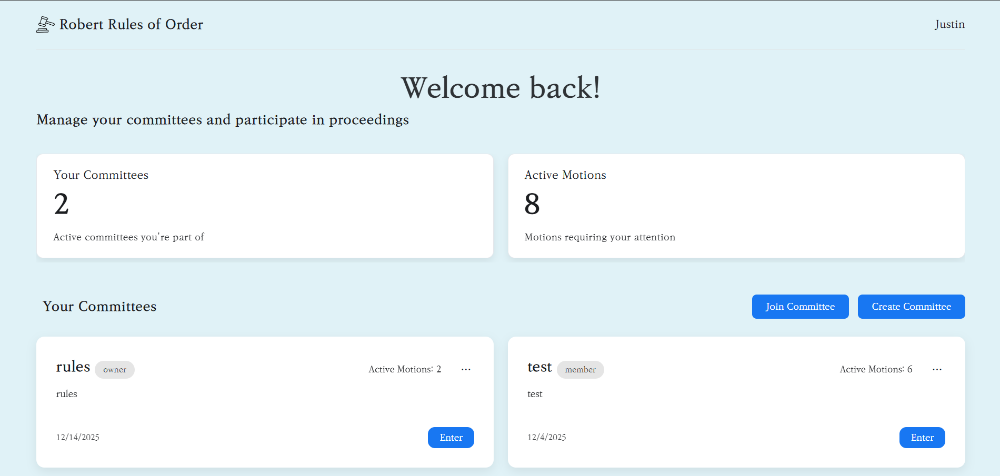
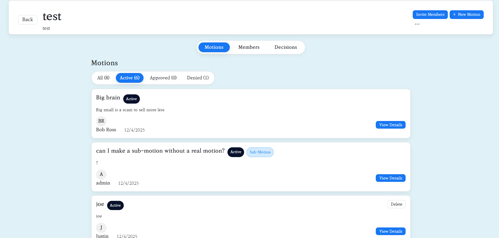

[](https://app.netlify.com/projects/polite-croissant-816eb9/deploys)

# RROO: Robert's Rules of Order Online

This web application is designed to facilitate parliamentary procedures based on Robert's Rules of Order. It allows users to manage motions, committees, and user profiles.

## Video Demo

[Link to YouTube Demo Video](https://www.youtube.com/watch?v=dQw4w9WgXcQ)

## Live Website

The application is hosted on Netlify and can be accessed here:

[https://csci432rroo.netlify.app/](https://csci432rroo.netlify.app/)

## Features

### Committees
- Create and manage committees for different groups.
- Each committee has its own set of members, motions, and decisions.
- Invite members to a committee using a unique invite code.



### Motions
- Create, view, and manage motions within a committee.
- Support for different types of motions: standard, sub-motions, special motions, and motions to overturn.
- Members can vote on active motions.
- Motion status is tracked (active, closed, completed, denied).



### Members
- View a list of all members in a committee.
- Committee owners and chairs can manage member roles (owner, chair, member).


### Decisions
- Record final decisions for motions that have been completed.
- Include a summary, pros, cons, and a link to a recording.


### Settings
- Committee owners and chairs can configure committee settings, such as default voting thresholds and whether a "second" is required for motions.


## Backend API

The backend is built using Netlify Functions and Firebase.

### `/.netlify/functions/users`

- **`GET /`**: Lists all users.
    - **Response:** `200 OK`
    ```json
    [
        {
            "uid": "...",
            "displayName": "...",
            "email": "..."
        }
    ]
    ```
- **`GET /?id=<userId>`**: Fetches a single user by ID.
    - **Response:** `200 OK`
    ```json
    {
        "uid": "...",
        "displayName": "...",
        "email": "..."
    }
    ```
- **`DELETE /?id=<userId>`**: Deletes a user (owner only).
    - **Response:** `204 No Content`

Most data is managed on the client-side via the Firebase SDK.

## Database Structure

The database is structured in Firebase Firestore.

### `committees` collection
Each document in this collection represents a committee.

- **`name`**: (string) The name of the committee.
- **`description`**: (string) The description of the committee.
- **`ownerUid`**: (string) The UID of the user who owns the committee.
- **`inviteCode`**: (string) A unique code to invite members.
- **`settings`**: (map) Committee settings.
    - **`defaultVoteThreshold`**: (string) e.g., "Simple Majority"
    - **`requireSecond`**: (boolean)
    - **`allowAnonymousVoting`**: (boolean)

#### `members` subcollection
Each document represents a member of the committee. The document ID is the user's UID.

- **`role`**: (string) "owner", "chair", or "member"
- **`joinedAt`**: (timestamp)

#### `motions` subcollection
Each document represents a motion.

- **`title`**: (string)
- **`description`**: (string)
- **`creatorUid`**: (string)
- **`creatorDisplayName`**: (string)
- **`createdAt`**: (timestamp)
- **`status`**: (string) "active", "closed", "completed", "denied", "deleted"
- **`kind`**: (string) "standard", "sub", "overturn", "special"
- **`parentMotionId`**: (string) (for sub-motions) The ID of the parent motion.
- **`relatedTo`**: (string) (for overturn motions) The ID of the motion to be overturned.
- **`tally`**: (map)
    - **`yes`**: (number)
    - **`no`**: (number)
    - **`abstain`**: (number)

#### `decisions` subcollection
Each document represents a recorded decision.

- **`motionId`**: (string)
- **`summary`**: (string)
- **`pros`**: (array of strings)
- **`cons`**: (array of strings)
- **`recordingUrl`**: (string)
- **`recordedBy`**: (string) UID of the user who recorded the decision.
- **`createdAt`**: (timestamp)